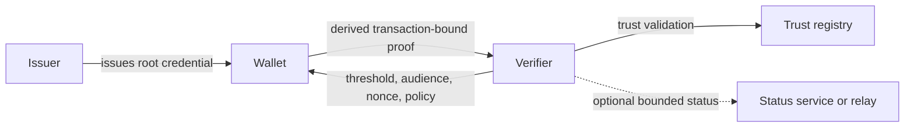

# Minimal Age Disclosure

Privacy-preserving age-threshold proof architecture for proving `18+` or similar thresholds without disclosing identity, exact date of birth, or a reusable cross-site identifier.

> Documentation-first standards and architecture project focused on minimal disclosure, anti-correlation, and governed verifier restraint.

## Why this matters
Most age-verification deployments still behave like identity collection systems with an age check attached. That creates avoidable privacy, security, and function-creep risk:
- services collect more data than needed
- supporting metadata becomes a tracking surface
- verifier behavior is often under-governed
- exceptional high-disclosure paths drift into the default operational route

This project proposes a narrower model:
prove age-threshold facts, not identity.

## What makes this approach different
- root credential stays in the wallet
- verifier sees a transaction-bound derived proof, not the root credential
- anti-correlation is treated as a first-class systems problem
- governance, conformance, retention, and exception handling are part of the architecture
- the project separates deployment-ready work from privacy-maximal research rather than pretending one profile solves both

## Core architecture
The repository centers on a **root credential -> derived proof** model inside one common governance model.

### Normal-flow disclosure target
In the normal flow, the verifier should receive only:
- threshold result
- bounded assurance information
- issuer information only to the minimum extent needed for trust validation
- bounded validity information
- audience binding
- nonce binding
- transaction-bound proof of rightful possession

The normal flow does **not** disclose:
- exact DOB
- legal name
- document number
- document image
- stable verifier-visible holder identifier
- stable verifier-visible root credential reference

## Diagram set
The full architecture diagrams live under [docs/architecture](docs/architecture/README.md), including:
- [Architecture Overview](docs/architecture/ARCHITECTURE_OVERVIEW.md)
- [Flows and Topology](docs/architecture/FLOWS_AND_TOPOLOGY.md)
- [Governance and Controls](docs/architecture/GOVERNANCE_AND_CONTROLS.md)
- [Dual Profile Overview](docs/architecture/DUAL_PROFILE_OVERVIEW.md)
- [Potential Final State](docs/architecture/POTENTIAL_FINAL_STATE.md)

## Profiles
### Profile R
Regulator-ready and interoperable profile:
- deployment fit first
- standards-aligned issuance and presentation rails
- conservative proof and status assumptions
- clear audit and conformance expectations

### Profile P
Privacy-maximal research profile:
- stronger unlinkability goals
- stronger metadata minimisation
- room for more ambitious proof constructions
- explicit research maturity boundaries

## Current status
This repository is a documentation-first standards and architecture project, not a production implementation.

Completed baseline:
- layered architecture published
- root credential / derived proof separation defined
- common governance model and dual-profile framing published
- normative core spec set drafted
- conformance checklist and privacy-negative test catalog drafted
- prototype planning kept documentation-only

Open by design:
- exact issuer resolution boundary
- minimum Profile R holder-binding mechanism
- assurance bucket taxonomy
- freshness and validity granularity
- verifier audit minimum
- exception-abuse thresholds

## Repository structure
### Architecture
- [Architecture Review and Changes](docs/architecture/ARCHITECTURE_REVIEW_AND_CHANGES.md)
- [Architecture Overview](docs/architecture/ARCHITECTURE_OVERVIEW.md)
- [Flows and Topology](docs/architecture/FLOWS_AND_TOPOLOGY.md)
- [Governance and Controls](docs/architecture/GOVERNANCE_AND_CONTROLS.md)
- [Dual Profile Overview](docs/architecture/DUAL_PROFILE_OVERVIEW.md)
- [Potential Final State](docs/architecture/POTENTIAL_FINAL_STATE.md)

### Normative specs
- [Age Threshold Proof Profile](spec/claim-profile/age-threshold-proof-profile.md)
- [Minimal-Disclosure Verifier Policy](spec/verifier-policy/minimal-disclosure-verifier-policy.md)
- [Issuer, Wallet, and Verifier Trust Model](spec/trust-model/issuer-wallet-verifier-trust-model.md)
- [Root vs Derived Proof Model](spec/root-derived-proof/root-vs-derived-proof-model.md)
- [Metadata Minimisation](spec/privacy/metadata-minimisation.md)
- [Conformance Checklist](spec/conformance/conformance-checklist.md)
- [Privacy-Negative Test Cases](spec/conformance/privacy-negative-test-cases.md)

### Governance and policy
- [Exception Governance](spec/verifier-policy/exception-governance.md)
- [Verifier Compliance and Retention](spec/verifier-policy/verifier-compliance-and-retention.md)
- [Recovery and Compromise](spec/trust-model/recovery-and-compromise.md)
- [Policy Pack Outline](docs/policy/policy-pack-outline.md)

### Project framing
- [Project Brief](PROJECT_BRIEF.md)
- [Requirements](REQUIREMENTS.md)
- [Threat Model Seed](THREAT_MODEL_SEED.md)
- [Repo Review and Roadmap](docs/research/repo-review-and-roadmap.md)
- [Revocation and Status Tradeoff Analysis](docs/research/revocation-status-tradeoff-analysis.md)
- [Prototype Implementation Plan](prototype/implementation-plan.md)

## Key open ADRs
- [ADR-0007: Exact issuer resolution for trust validation](docs/adr/0007-exact-issuer-resolution-for-trust-validation.md)
- [ADR-0008: Minimum holder-binding mechanism for Profile R](docs/adr/0008-minimum-holder-binding-mechanism-for-profile-r.md)
- [ADR-0010: Assurance bucket taxonomy and request semantics](docs/adr/0010-assurance-bucket-taxonomy-and-request-semantics.md)
- [ADR-0011: Validity granularity and freshness policy boundaries](docs/adr/0011-validity-granularity-and-freshness-policy-boundaries.md)
- [ADR-0014: Verifier audit record minimum](docs/adr/0014-verifier-audit-record-minimum.md)
- [ADR-0015: Exception-path abuse thresholds and enforcement](docs/adr/0015-exception-path-abuse-thresholds-and-enforcement.md)

## Roadmap
1. Resolve the ADR-backed architectural contradictions.
2. Promote draft normative clauses into a stable baseline.
3. Tighten profile-specific conformance deltas for Profile R and Profile P.
4. Refine UK/EU policy mapping without overstating deployment acceptance.
5. Begin narrow prototype implementation only after the unresolved interface assumptions are decided.

## Design principles
- minimum disclosure
- privacy by design
- anti-correlation as a first-class goal
- compatibility before reinvention
- explicit tradeoffs
- verifier restraint as architecture
- conformance and governance as first-class concerns

## Audience
- digital identity practitioners
- security and privacy engineers
- policy and trust-framework stakeholders
- standards participants
- reviewers interested in the idea and the project’s progress

## Contribution and security
See [CONTRIBUTING.md](CONTRIBUTING.md) and [SECURITY.md](SECURITY.md).
