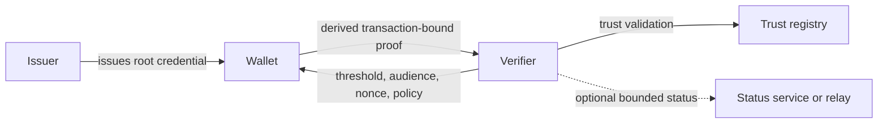

# Minimal Age Disclosure

Privacy-preserving age-threshold proof architecture for proving `18+` or similar thresholds without disclosing identity, exact date of birth, or a reusable cross-site identifier.

> Documentation-first architecture and standards project for minimal age disclosure, anti-correlation, and verifier restraint.

**Quick links:** [Start Here](#start-here) | [Project Status](#project-status) | [Open Decisions](#open-decisions) | [Document Map](#document-map) | [Contributing](CONTRIBUTING.md)

## At a Glance

This repository argues for a narrow thesis:

**services should verify an age threshold, not collect identity.**

The project explores a model where a wallet holds a root credential and presents a transaction-bound derived proof to a verifier. The verifier should learn only what is necessary to answer the policy question, such as `18+`, and no more.

This is not a production implementation. It is a public documentation set intended to make the architecture, governance model, tradeoffs, and unresolved decisions legible.

## Start Here

Choose the path that matches what you need:

- New to the project: read [Project Brief](PROJECT_BRIEF.md), then this README's status and architecture sections.
- Evaluating the core technical model: read [Architecture Overview](docs/architecture/ARCHITECTURE_OVERVIEW.md) and [Root vs Derived Proof Model](spec/root-derived-proof/root-vs-derived-proof-model.md).
- Assessing verifier obligations: read [Minimal-Disclosure Verifier Policy](spec/verifier-policy/minimal-disclosure-verifier-policy.md), [Verifier Compliance and Retention](spec/verifier-policy/verifier-compliance-and-retention.md), and [Exception Governance](spec/verifier-policy/exception-governance.md).
- Looking for maturity and unresolved questions: jump to [Project Status](#project-status) and [Open Decisions](#open-decisions).
- Want the full map: see [Document Map](#document-map).

## Why It Matters

Many age-verification systems still operate like identity capture systems with an age check attached. That shifts the problem from "prove a threshold" to "collect enough data to feel comfortable," which creates predictable failure modes:

- excessive disclosure becomes normal rather than exceptional
- supporting metadata becomes a tracking and correlation surface
- verifier behavior is under-specified or weakly governed
- retention and exception handling drift beyond the original purpose

This project takes the opposite position:

- prove threshold facts, not identity
- minimize verifier-visible data in the normal flow
- treat anti-correlation as a system requirement, not a nice-to-have
- make governance, conformance, and exception boundaries part of the architecture

## Architecture at a Glance

The repository centers on a **root credential -> derived proof** model within a common trust and governance framework.

### Normal-Flow Disclosure Target

In the normal flow, the verifier should receive only what is needed to decide whether the threshold requirement is satisfied:

- threshold result
- bounded assurance information
- issuer information only to the minimum extent needed for trust validation
- bounded validity information
- audience binding
- nonce binding
- transaction-bound proof of rightful possession

The normal flow should not disclose:

- exact date of birth
- legal name
- document number
- document image
- stable verifier-visible holder identifier
- stable verifier-visible root credential reference

## Principles

- minimum disclosure over convenience-by-default
- privacy by design, including metadata minimisation
- anti-correlation as a first-class architectural objective
- compatibility and deployment realism where possible
- explicit treatment of tradeoffs and residual risks
- verifier restraint enforced through policy, controls, and conformance
- exception paths treated as bounded and governed, not assumed-safe

## Project Status

### What This Repository Is

- a documentation-first privacy architecture project
- a standards and governance exploration grounded in concrete verifier behavior
- a public design space for privacy-preserving age-threshold proofs

### What This Repository Is Not

- not a production implementation
- not a claim of regulatory approval or ecosystem acceptance
- not a statement that one profile solves every deployment context

### Current Maturity

Completed baseline:

- layered architecture published
- root credential versus derived proof separation defined
- common governance model and dual-profile framing published
- normative core spec set drafted
- conformance checklist and privacy-negative test catalog drafted
- prototype work intentionally kept at planning level

Still open by design:

- exact issuer resolution boundary
- minimum Profile R holder-binding mechanism
- assurance bucket taxonomy
- freshness and validity granularity
- verifier audit minimum
- exception-path abuse thresholds

## Profiles

The project deliberately separates a more deployment-oriented profile from a more privacy-maximal research profile instead of implying a single design can satisfy both without tradeoffs.

### Profile R

Regulator-ready and interoperability-oriented:

- deployment fit first
- standards-aligned issuance and presentation rails
- conservative proof and status assumptions
- clearer audit and conformance expectations

### Profile P

Privacy-maximal research profile:

- stronger unlinkability goals
- stronger metadata minimisation
- room for more ambitious proof constructions
- explicit research maturity boundaries

## Open Decisions

The most important unresolved architectural questions are tracked as ADRs:

- [ADR-0007: Exact issuer resolution for trust validation](docs/adr/0007-exact-issuer-resolution-for-trust-validation.md)
- [ADR-0008: Minimum holder-binding mechanism for Profile R](docs/adr/0008-minimum-holder-binding-mechanism-for-profile-r.md)
- [ADR-0010: Assurance bucket taxonomy and request semantics](docs/adr/0010-assurance-bucket-taxonomy-and-request-semantics.md)
- [ADR-0011: Validity granularity and freshness policy boundaries](docs/adr/0011-validity-granularity-and-freshness-policy-boundaries.md)
- [ADR-0014: Verifier audit record minimum](docs/adr/0014-verifier-audit-record-minimum.md)
- [ADR-0015: Exception-path abuse thresholds and enforcement](docs/adr/0015-exception-path-abuse-thresholds-and-enforcement.md)

These are not minor details. They are the decisions that determine whether the architecture remains minimally disclosive under operational pressure.

## Document Map

### Core Reading

- [Project Brief](PROJECT_BRIEF.md)
- [Requirements](REQUIREMENTS.md)
- [Threat Model Seed](THREAT_MODEL_SEED.md)

### Architecture

- [Architecture Overview](docs/architecture/ARCHITECTURE_OVERVIEW.md)
- [Flows and Topology](docs/architecture/FLOWS_AND_TOPOLOGY.md)
- [Governance and Controls](docs/architecture/GOVERNANCE_AND_CONTROLS.md)
- [Dual Profile Overview](docs/architecture/DUAL_PROFILE_OVERVIEW.md)
- [Potential Final State](docs/architecture/POTENTIAL_FINAL_STATE.md)
- [Architecture Review and Changes](docs/architecture/ARCHITECTURE_REVIEW_AND_CHANGES.md)

### Normative Specifications

- [Age Threshold Proof Profile](spec/claim-profile/age-threshold-proof-profile.md)
- [Minimal-Disclosure Verifier Policy](spec/verifier-policy/minimal-disclosure-verifier-policy.md)
- [Issuer, Wallet, and Verifier Trust Model](spec/trust-model/issuer-wallet-verifier-trust-model.md)
- [Root vs Derived Proof Model](spec/root-derived-proof/root-vs-derived-proof-model.md)
- [Metadata Minimisation](spec/privacy/metadata-minimisation.md)
- [Conformance Checklist](spec/conformance/conformance-checklist.md)
- [Privacy-Negative Test Cases](spec/conformance/privacy-negative-test-cases.md)

### Governance and Policy

- [Exception Governance](spec/verifier-policy/exception-governance.md)
- [Verifier Compliance and Retention](spec/verifier-policy/verifier-compliance-and-retention.md)
- [Recovery and Compromise](spec/trust-model/recovery-and-compromise.md)
- [Policy Pack Outline](docs/policy/policy-pack-outline.md)

### Research and Planning

- [Repo Review and Roadmap](docs/research/repo-review-and-roadmap.md)
- [Revocation and Status Tradeoff Analysis](docs/research/revocation-status-tradeoff-analysis.md)
- [Prototype Implementation Plan](prototype/implementation-plan.md)

## How to Read the Repository

If you want a short pass:

1. Read [Project Brief](PROJECT_BRIEF.md).
2. Read [Architecture Overview](docs/architecture/ARCHITECTURE_OVERVIEW.md).
3. Read [Root vs Derived Proof Model](spec/root-derived-proof/root-vs-derived-proof-model.md).
4. Check [Project Status](#project-status) and [Open Decisions](#open-decisions).

If you want to review the architecture critically:

1. Read the architecture set under [docs/architecture](docs/architecture/README.md).
2. Review the verifier-policy and conformance documents together.
3. Inspect the ADRs before treating any interface boundary as settled.

## Contribution Path

This project is documentation-led. Useful contributions are typically one of:

- challenge a privacy or anti-correlation assumption with a concrete counterexample
- tighten a normative requirement or conformance clause
- identify verifier-side over-collection or retention gaps
- improve policy, trust, or exception governance language
- help resolve an open ADR with a clear tradeoff analysis

Before proposing major changes, review the architecture docs and relevant ADRs so discussions stay anchored to the current decision record.

See [CONTRIBUTING.md](CONTRIBUTING.md), [SUPPORT.md](SUPPORT.md), and [SECURITY.md](SECURITY.md).

## How to Engage

This repository is likely most useful to:

- digital identity practitioners
- privacy and security engineers
- standards participants
- trust framework and policy stakeholders
- reviewers evaluating whether age assurance can be designed without default identity disclosure

The highest-value engagement is specific critique. If a section overstates privacy properties, understates deployment constraints, or leaves verifier behavior under-governed, that is exactly the kind of feedback this repository should attract.

## Roadmap Direction

The current direction is:

1. resolve the ADR-backed architectural contradictions
2. promote draft normative clauses into a more stable baseline
3. tighten profile-specific conformance deltas for Profile R and Profile P
4. refine UK and EU policy mapping without overstating likely acceptance
5. begin narrow implementation work only after unresolved interface assumptions are decided
