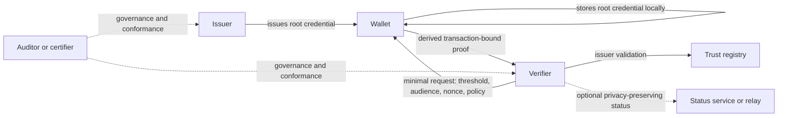

# Architecture Overview

## Core thesis
A relying party should be able to decide whether a holder meets an age threshold without learning the holder's identity or receiving a reusable tracking handle.

## Layered model

### 1. Governance plane
Defines:
- issuer classes
- verifier classes
- trust registry boundaries
- conformance and sanctions
- exception governance

### 2. Root credential plane
Defines:
- evidence checking and issuance
- local wallet storage
- root credential lifecycle
- renewal, suspension, and recovery boundaries

### 3. Derived proof plane
Defines:
- transaction-bound proof generation
- disclosure minimisation
- proof-binding approach
- profile-specific proof options

### 4. Verification plane
Defines:
- verifier request object
- threshold evaluation
- proof validation
- local decisioning
- retention and telemetry boundaries

### 5. Status and recovery plane
Defines:
- issuer trust state
- root credential state
- compromise handling
- recovery and re-issuance
- privacy-preserving status where justified

### 6. Exception plane
Defines:
- higher-disclosure path
- lawful basis requirement
- red-path wallet UX
- audit and sanctions

## Normal flow
1. Issuer checks evidence once.
2. Issuer issues a root credential to the wallet.
3. Wallet stores the root credential locally.
4. Verifier sends a minimal request with threshold, audience, nonce, and policy context.
5. Wallet derives a transaction-bound proof from the root credential.
6. Verifier validates the proof, trust, and policy conditions locally.
7. Verifier retains only minimal decision evidence under policy.

## Normal-flow disclosure target
The verifier should receive only:
- threshold result
- coarse assurance metadata
- coarse issuer information by default
- bounded validity information
- audience binding
- nonce binding
- transaction-bound rightful-possession proof material that is not a stable verifier-visible holder identifier

## Normal-flow exclusions
The verifier should not receive:
- legal name
- exact date of birth
- document number
- document image
- a stable holder identifier
- a stable root credential reference
- token-specific live issuer callbacks by default

## Mermaid overview

