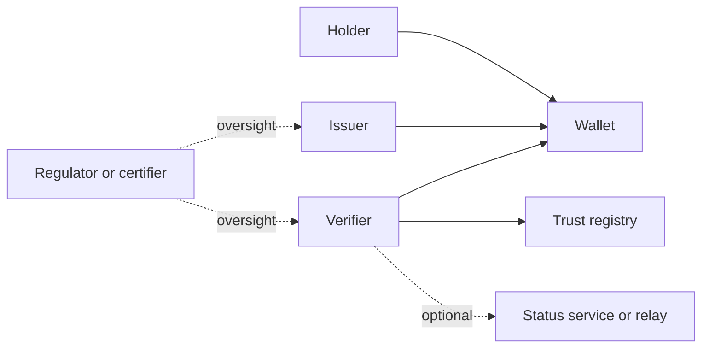
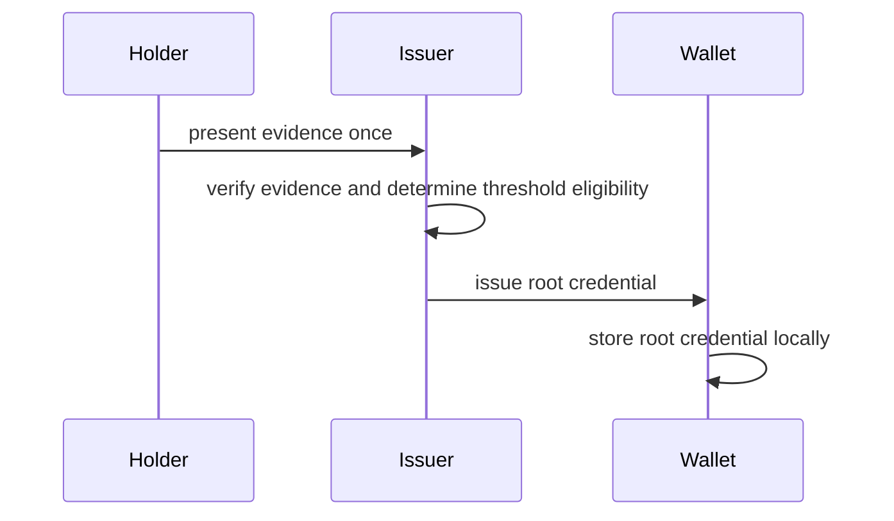
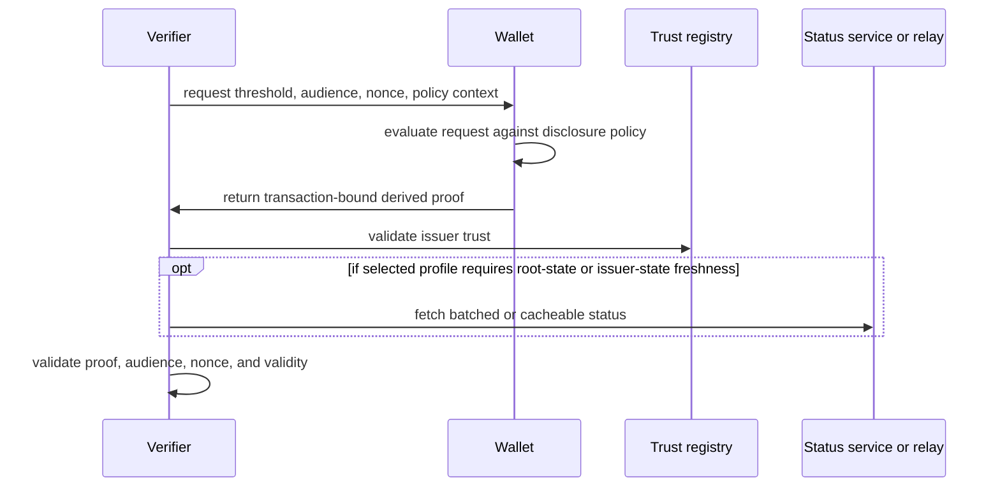
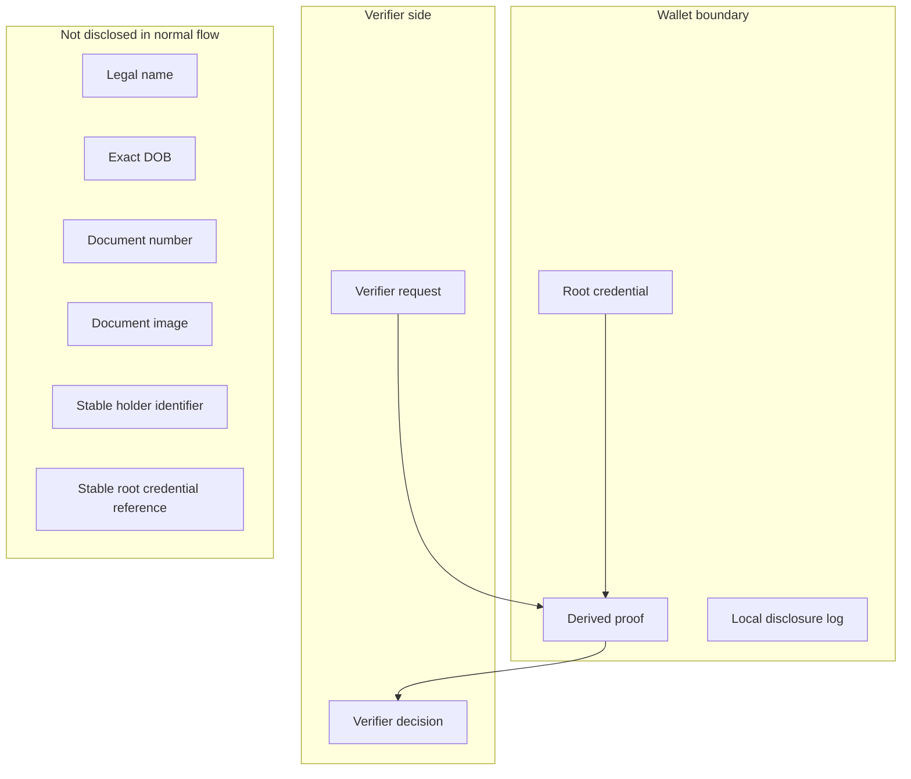
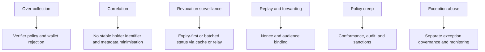

# Flows and Topology

## System context

```mermaid
flowchart LR
    H[Holder] --> W[Wallet]
    I[Issuer] --> W
    V[Verifier] --> W
    V --> T[Trust registry]
    V -. optional .-> S[Status service or relay]
    R[Regulator or certifier] -. oversight .-> I
    R -. oversight .-> V
```

## Issuance sequence

```mermaid
sequenceDiagram
    participant H as Holder
    participant I as Issuer
    participant W as Wallet

    H->>I: present evidence once
    I->>I: verify evidence and determine threshold eligibility
    I->>W: issue root credential
    W->>W: store root credential locally
```

## Normal presentation sequence

```mermaid
sequenceDiagram
    participant V as Verifier
    participant W as Wallet
    participant T as Trust registry
    participant S as Status service or relay

    V->>W: request threshold, audience, nonce, policy context
    W->>W: evaluate request against disclosure policy
    W->>V: return transaction-bound derived proof
    V->>T: validate issuer trust
    opt if selected profile requires root-state or issuer-state freshness
        V->>S: fetch batched or cacheable status
    end
    V->>V: validate proof, audience, nonce, and validity
```

## Privacy boundary

```mermaid
flowchart TB
    subgraph Wallet boundary
        RC[Root credential]
        DP[Derived proof]
        LOG[Local disclosure log]
    end

    subgraph Verifier side
        VR[Verifier request]
        VD[Verifier decision]
    end

    subgraph Not disclosed in normal flow
        ND1[Legal name]
        ND2[Exact DOB]
        ND3[Document number]
        ND4[Document image]
        ND5[Stable holder identifier]
        ND6[Stable root credential reference]
    end

    VR --> DP
    RC --> DP
    DP --> VD
```

## Threat-to-control map

```mermaid
flowchart TD
    T1[Over-collection] --> C1[Verifier policy and wallet rejection]
    T2[Correlation] --> C2[No stable holder identifier and metadata minimisation]
    T3[Revocation surveillance] --> C3[Expiry-first or batched status via cache or relay]
    T4[Replay and forwarding] --> C4[Nonce and audience binding]
    T5[Policy creep] --> C5[Conformance, audit, and sanctions]
    T6[Exception abuse] --> C6[Separate exception governance and monitoring]
```
