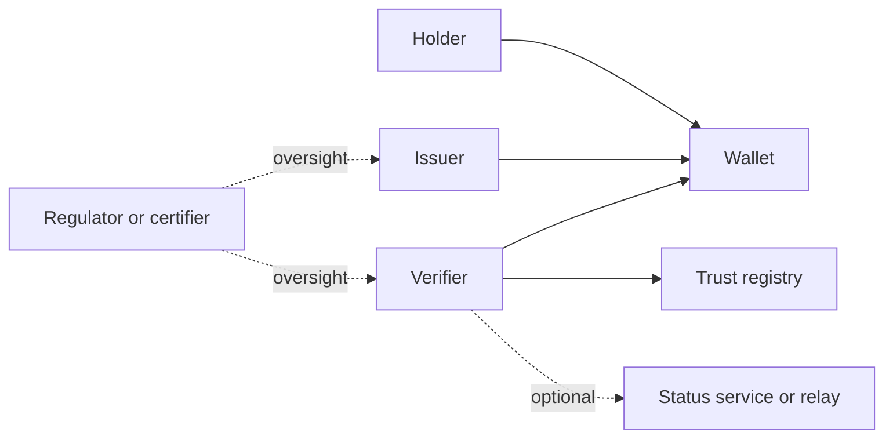
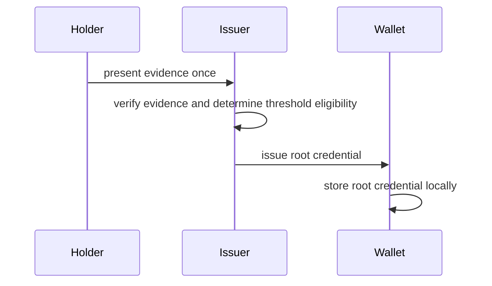
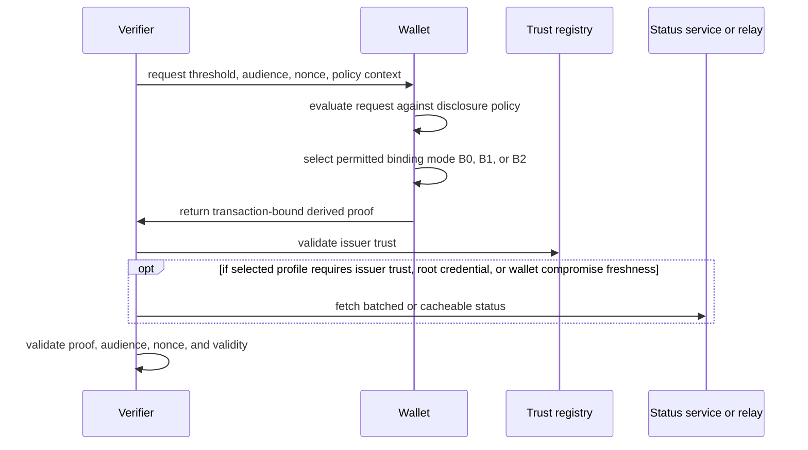
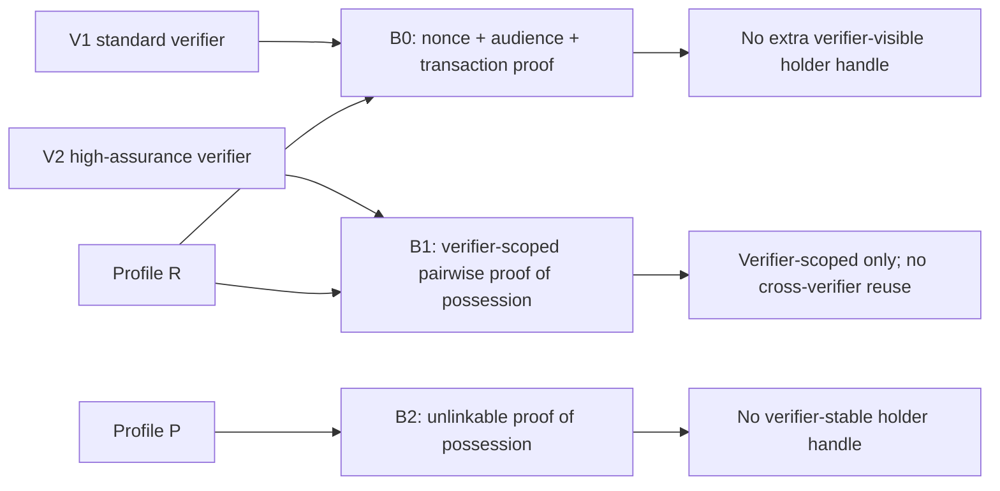
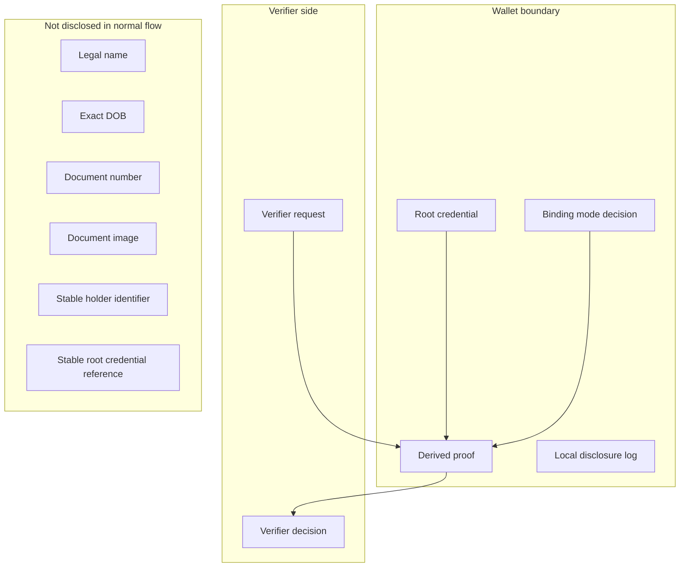
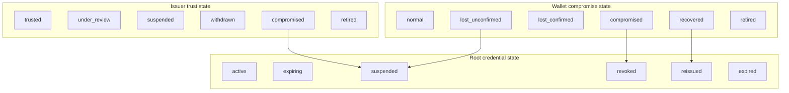
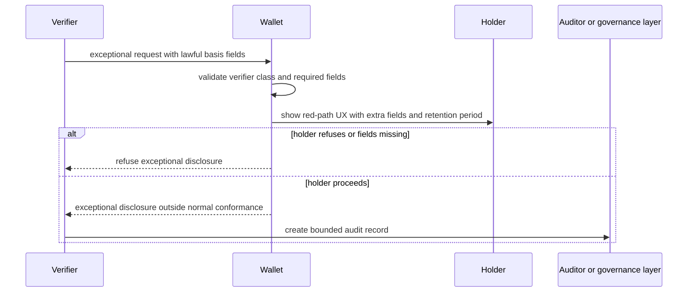
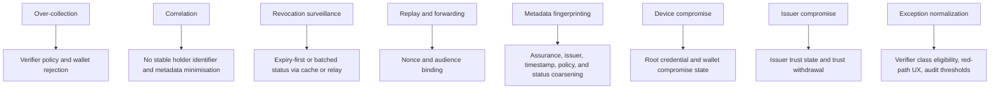

# Flows and Topology

> This page turns the architecture thesis into system context and interaction flows. Use it after [Architecture Overview](./ARCHITECTURE_OVERVIEW.md) when you want to see the moving parts in order.

## In This Document
- [How to read this page](#how-to-read-this-page)
- [Quick links](#quick-links)
- [System context](#system-context)
- [Issuance sequence](#issuance-sequence)
- [Normal presentation sequence](#normal-presentation-sequence)
- [Binding-mode matrix](#binding-mode-matrix)
- [Privacy boundary](#privacy-boundary)
- [Recovery and state domains](#recovery-and-state-domains)
- [Exception red-path sequence](#exception-red-path-sequence)
- [Threat-to-control map](#threat-to-control-map)
- [Related architecture pages](#related-architecture-pages)

## How to Read This Page
- Read the diagrams from top to bottom: context first, then issuance, then presentation.
- Use the privacy boundary diagram to separate what stays inside the wallet from what crosses to the verifier.
- Use the threat-to-control map as a bridge into [Governance and Controls](./GOVERNANCE_AND_CONTROLS.md).

## Quick Links
| For... | Go to... |
| --- | --- |
| the thesis behind these flows | [Architecture Overview](./ARCHITECTURE_OVERVIEW.md) |
| control and policy interpretation | [Governance and Controls](./GOVERNANCE_AND_CONTROLS.md) |
| profile-specific reading | [Dual Profile Overview](./DUAL_PROFILE_OVERVIEW.md) |
| mature ecosystem assumptions | [Potential Final State](./POTENTIAL_FINAL_STATE.md) |

## System Context
This diagram identifies the main actors and the permitted trust and oversight relationships at system level. It is the quickest way to orient yourself before reading the sequences.

## Issuance Sequence
This sequence covers the one-time evidence check and root credential issuance path. The key boundary is that evidence checking happens once, while later verifier interactions depend on derived proofs rather than re-presenting the root credential.

## Normal Presentation Sequence
This is the default verification path for minimal disclosure. The verifier asks for a threshold result plus transaction context, and the wallet returns a derived proof rather than identity data or the root credential.

## Binding-Mode Matrix
This diagram shows how binding modes map to verifier classes and profiles. The invariant is that no normal-flow mode creates a reusable verifier-visible proof-binding artifact.

## Privacy Boundary
This diagram makes the normal-flow privacy boundary explicit. Root credentials and disclosure logs stay inside the wallet boundary, while only the verifier request and decision artifacts appear on the verifier side.

## Recovery and State Domains
Recovery and compromise handling is split into three state domains so that compromise response does not require presentation logs.

## Exception Red-Path Sequence
Exceptional disclosure is outside normal-flow conformance. The wallet must make the path explicit and the verifier must supply lawful-basis fields before any higher disclosure is considered.

## Threat-to-Control Map
Use this as a quick index from common failure modes to the architectural control intended to mitigate them. The control vocabulary is expanded in [Governance and Controls](./GOVERNANCE_AND_CONTROLS.md).

## Related Architecture Pages
- [Architecture Overview](./ARCHITECTURE_OVERVIEW.md): the thesis, planes, and normal-flow disclosure objective.
- [Governance and Controls](./GOVERNANCE_AND_CONTROLS.md): the control domains behind the threat map.
- [Dual Profile Overview](./DUAL_PROFILE_OVERVIEW.md): how these flows vary in emphasis between `Profile R` and `Profile P`.
- [Potential Final State](./POTENTIAL_FINAL_STATE.md): the future-state network these flows should fit into.
