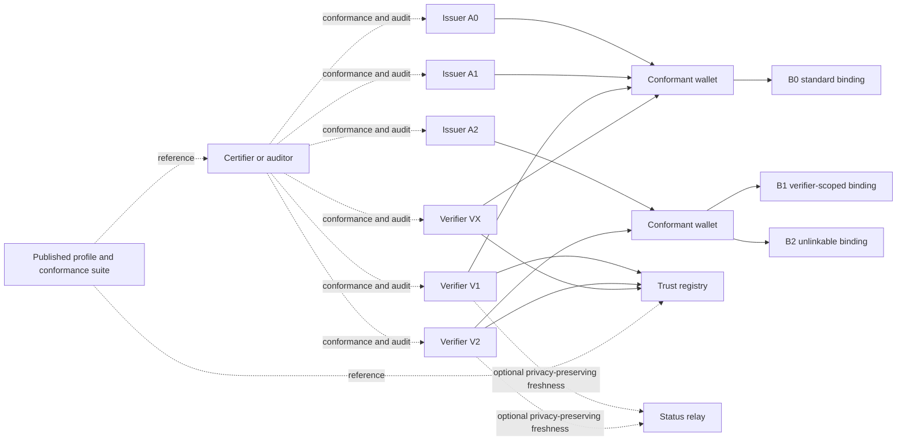

# Potential Final State

> This page describes the mature target ecosystem implied by the current architecture. It is a target-state concept, not a claim about the current implementation state.

## In This Document
- [How to read this page](#how-to-read-this-page)
- [Quick links](#quick-links)
- [Purpose](#purpose)
- [Target-state diagram](#target-state-diagram)
- [Target-state characteristics](#target-state-characteristics)
- [Related architecture pages](#related-architecture-pages)

## How to Read This Page
- Treat this page as a destination model for a mature ecosystem.
- Read it after the current architecture thesis, flows, and controls are clear.
- Use it to understand scale, conformance, and governance ambitions without reading it as a near-term delivery plan.

## Quick Links
| For... | Go to... |
| --- | --- |
| the current architecture thesis | [Architecture Overview](./ARCHITECTURE_OVERVIEW.md) |
| current interaction flows | [Flows and Topology](./FLOWS_AND_TOPOLOGY.md) |
| governance and control foundations | [Governance and Controls](./GOVERNANCE_AND_CONTROLS.md) |
| the dual-profile strategy behind future evolution | [Dual Profile Overview](./DUAL_PROFILE_OVERVIEW.md) |

## Purpose
This is a target-state concept for a mature ecosystem, not a statement of current implementation.

## Target-State Diagram
This diagram shows the scaled ecosystem shape: multiple issuer classes, multiple verifier classes, conformant wallets, a trust registry, optional privacy-preserving freshness infrastructure, and a published conformance layer tying the ecosystem together.

## Target-State Characteristics
- multiple issuers under one governance model
- multiple conformant wallets and verifiers
- trusted-list or registry-based issuer validation
- explicit `B0`, `B1`, and `B2` binding modes
- separated issuer trust, root credential, and wallet compromise state domains
- privacy-preserving status only where justified
- published profile and conformance suite
- audit and sanctions for verifier abuse

## Related Architecture Pages
- [Architecture Overview](./ARCHITECTURE_OVERVIEW.md): the thesis and layered structure this future state extends.
- [Flows and Topology](./FLOWS_AND_TOPOLOGY.md): the core flows that remain valid as the ecosystem scales.
- [Governance and Controls](./GOVERNANCE_AND_CONTROLS.md): the governance model required to keep the target state trustworthy.
- [Dual Profile Overview](./DUAL_PROFILE_OVERVIEW.md): how both profiles may contribute to the eventual mature state.
