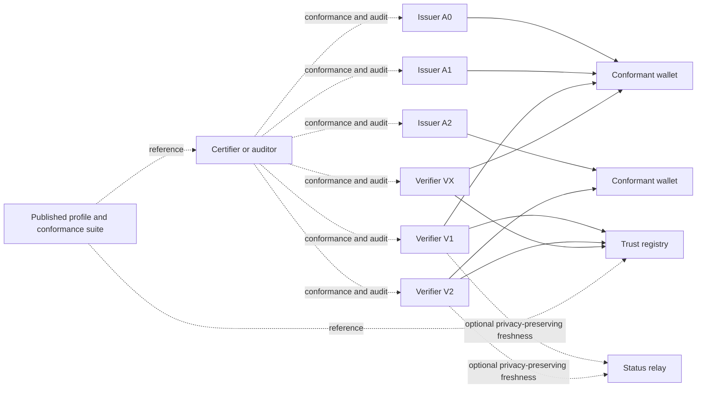

# Potential Final State

## Purpose
This is a target-state concept for a mature ecosystem, not a statement of current implementation.

## Target-state characteristics
- multiple issuers under one governance model
- multiple conformant wallets and verifiers
- trusted-list or registry-based issuer validation
- privacy-preserving status only where justified
- published profile and conformance suite
- audit and sanctions for verifier abuse
